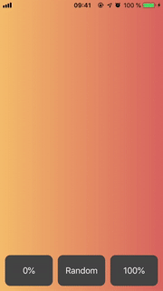
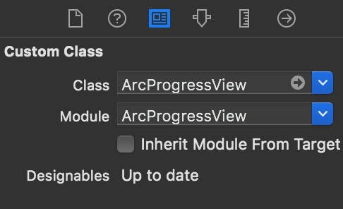
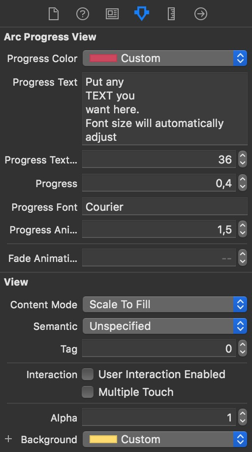

# ArcProgressView

[](https://app.bitrise.io/app/97b90fdf4c067f66)
[](https://cocoapods.org/pods/ArcProgressView)
[](https://cocoapods.org/pods/ArcProgressView)
[](https://cocoapods.org/pods/ArcProgressView)

## Example

To run the example project, clone the repo, and run `pod install` from the Example directory first.



## Installation

ArcProgressView is available through [CocoaPods](https://cocoapods.org). To install
it, simply add the following line to your Podfile:

```ruby
pod 'ArcProgressView'
```

## Usage

Beside the programmatical creation of the ArcProgressView you can use it inside a Storyboard too. Simply create an `UIView` and set the class and module to `ArcProgressView` inside the `Identity Inspector`.



Once configured as `ArcProgressView` you should be able to set up its attributes in the `Attributes Inspector`



Have fun playing around with combinations of the `Progress Color` and the views `Background Color`.

## Author

mlostek@gmail.com

## License

ArcProgressView is available under the MIT license. See the LICENSE file for more info.
